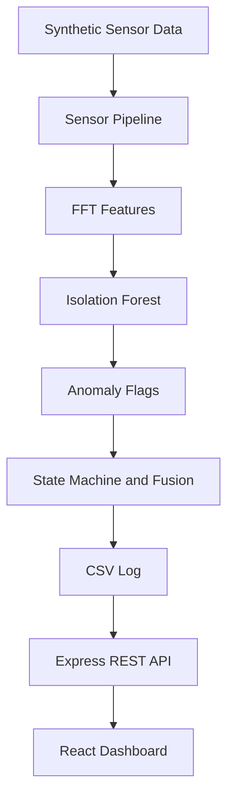

# Sentinel V1 Architecture

## System overview

Sentinel V1 is a local synthetic-data demonstration. The Python pipeline performs signal processing, machine-learning inference, anomaly fusion, state transitions, and CSV logging. Express exposes the CSV through REST. The React dashboard polls the REST API.



## Component responsibilities

| Component | Responsibility | Implementation |
|---|---|---|
| Synthetic signals | Produce deterministic vibration and acoustic windows plus scalar sensor values | `backend/sensor_pipeline.py` |
| FFT extraction | Produce five numeric features from a signal window | `backend/fft_features.py` |
| Calibration | Generate normal training vectors and fit the model | `backend/baseline_calibration.py` |
| ML model | Detect observations outside the synthetic normal distribution | scikit-learn `IsolationForest` in a `StandardScaler` pipeline |
| Fusion | Convert model/sensor conditions into modality flags | `sensor_pipeline.classify()` |
| State machine | Apply persistence and state transitions | `backend/state_machine.py` |
| CSV storage | Append the telemetry contract | `backend/mock_data/sensor_log.csv` |
| REST API | Read telemetry/events and expose test alert | `backend/server.js` |
| Dashboard | Poll and render telemetry, events, charts, and state | `frontend/src/App.jsx` |

## Data flow

1. `synthetic_reading()` creates seeded vibration/acoustic arrays and scalar values.
2. `feature_vector()` extracts the five features for each modality and concatenates ten values.
3. The persisted Isolation Forest returns a prediction for the vector.
4. `classify()` derives ML, vibration, acoustic, pressure, and strain flags.
5. `StateMachine.update()` counts flags and applies persistence.
6. `append_row()` writes the status and sensor values to the CSV.
7. Express reads the latest or last 20 rows.
8. React polls the endpoints every two seconds and updates the dashboard.

## ML flow

The training path uses seeded normal windows:

```text
normal vibration window + normal acoustic window
        |
        v
5 vibration features + 5 acoustic features
        |
        v
StandardScaler
        |
        v
IsolationForest(n_estimators=200, contamination=0.05, random_state=42)
        |
        v
backend/models/isolation_forest.pkl
```

Inference uses the saved model. The application does not generate random statuses. The model prediction is one input to the multi-sensor flag logic; pressure and strain flags are derived from the synthetic scalar values.

## API flow

- `GET /api/telemetry` reads the last CSV row and adds server uptime plus heuristic risk presentation fields.
- `GET /api/events` reads up to 20 recent rows newest first.
- `POST /api/test-alert` executes the existing development SMS script path and returns a success/fallback response.
- `GET /api/camera` serves the generated placeholder image when present.

## Frontend flow

`frontend/src/App.jsx` uses browser `fetch()` calls to poll telemetry and events every two seconds. It renders the state, sensor charts, event history, connection state, risk presentation, and existing dashboard controls. It uses REST only; there is no WebSocket client.

## File/component mapping

```text
backend/fft_features.py                  Feature extraction
backend/baseline_calibration.py         Synthetic training and model persistence
backend/sensor_pipeline.py              Processing, flags, state, CSV
backend/state_machine.py                Temporal state logic
backend/models/isolation_forest.pkl     Persisted trained model
backend/mock_data/generate_mock.js       Repeating/demo launcher
backend/mock_data/sensor_log.csv         Runtime data contract
backend/server.js                        Express API
backend/tests/test_v1.py                 Automated V1 verification
frontend/src/App.jsx                     Dashboard and REST polling
frontend/src/main.jsx                    React bootstrap
frontend/vite.config.js                  Vite port/build settings
```

## V1 to V2 boundary

V1 ends at the synthetic pipeline, CSV, Express, and React dashboard. V2 may replace synthetic acquisition with Jetson-connected sensors and real calibration while preserving the CSV/API contract initially. Hardware candidates named in project planning include LIS3DH, ADXL345, BMP280, INMP441, IMX219, and GSM. None are required or integrated by V1.
